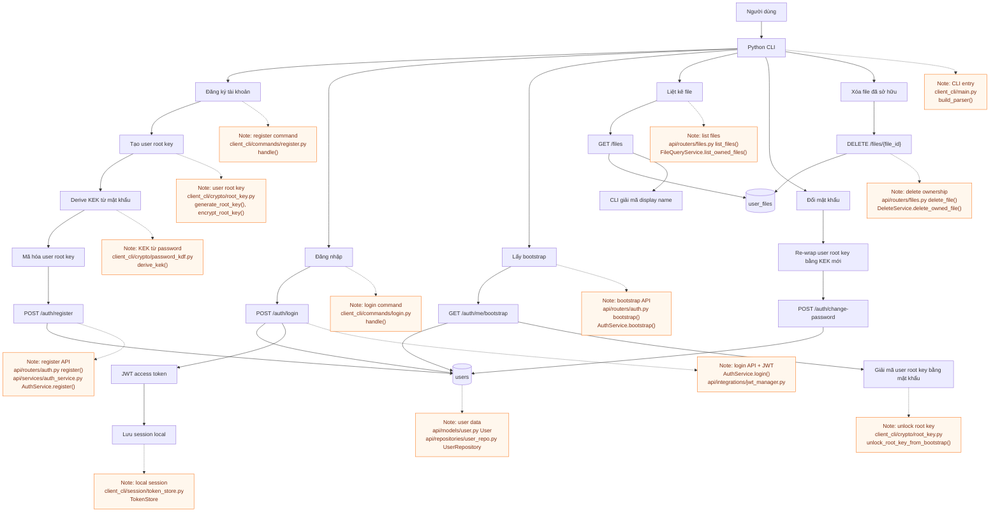
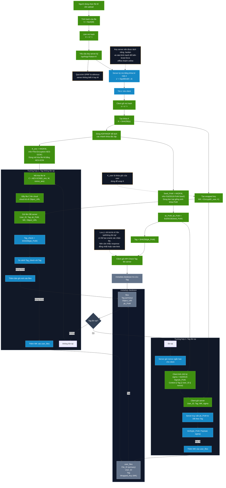
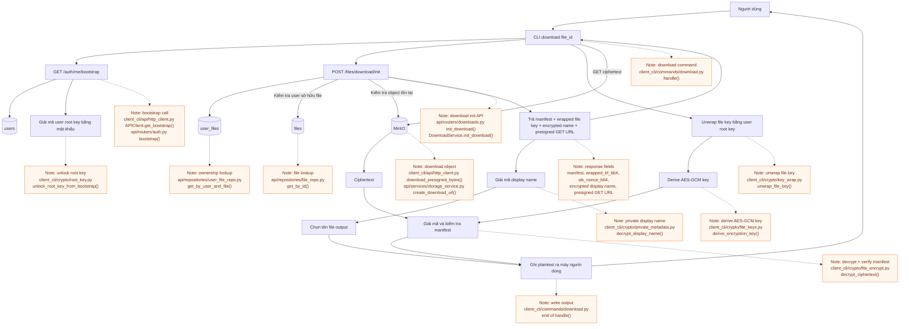

# Secure Dedup Project Flow

Tài liệu này chia hệ thống thành 3 luồng riêng để dễ đọc: xác thực người dùng, upload, và download.

## 1. Luồng đăng ký, đăng nhập và thao tác người dùng

## 2. Luồng hệ thống upload

### Các điểm thiếu/cần làm rõ trong flow upload

- `K_user` chưa được sinh/khôi phục trong flow hình. Cần có bước đăng nhập hoặc bootstrap để giải mã user root key trước khi tạo `WK = Encrypt(K_user, K)`.
- Endpoint OPRF `/oprf/sign` là thiết kế mục tiêu. Code hiện tại vẫn dùng mock OPRF local, chưa có OPRF server thật.
- Nonce ở nhánh claim cần TTL ngắn, chỉ dùng một lần, và phải gắn với `User_ID`, `Tag`, `context`.
- Flow hình chưa thể hiện xác thực request bằng JWT/session.
- Flow hình chưa có encrypted display name theo từng user, trong khi project hiện tại có `enc_display_name_b64` và `display_name_nonce_b64`.
- Flow hình đơn giản hóa upload cloud thành một bước. Project hiện tại nên có `upload/init`, presigned PUT, rồi `upload/complete`.
- Server cần kiểm tra object đã tồn tại sau khi upload; tốt hơn nữa là kiểm tra size/hash ciphertext so với manifest.
- Cần ghi rõ `sk_PoW` không được lưu lâu dài; client nên derive tạm trong RAM rồi xóa sau khi ký.
- Cần quy định TTL/quyền truy cập cho `Object_URL` hoặc dùng presigned URL thay vì URL vật lý lâu dài.
- Schema trong hình đơn giản hóa DB. Code hiện tại dùng `files.id` làm primary key, `tag_hex` unique, và `user_files.file_id` trỏ sang `files.id`.
- Cần xử lý race condition khi hai client cùng upload một Tag chưa tồn tại.
- Cần tránh file confirmation oracle: response của check/claim nên được rate-limit và thiết kế để không dễ xác nhận người khác có file hay không.

## 3. Luồng hệ thống download

## Bảng dữ liệu chính

- `users`: tài khoản, password hash, encrypted user root key.
- `files`: metadata file dùng chung, định danh bởi `tag_hex`.
- `user_files`: quyền sở hữu theo từng user, wrapped file key, encrypted display name.
- `upload_sessions`: phiên upload tạm thời giữa init và complete.
- `pow_challenges`: challenge ngắn hạn để claim file đã tồn tại.
- `MinIO`: chỉ lưu ciphertext object.
